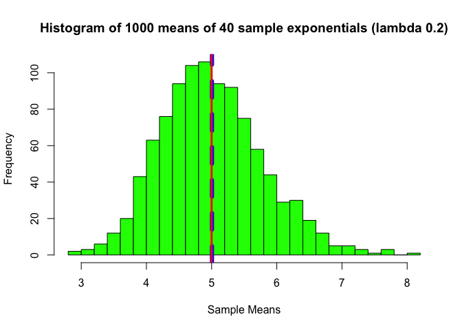
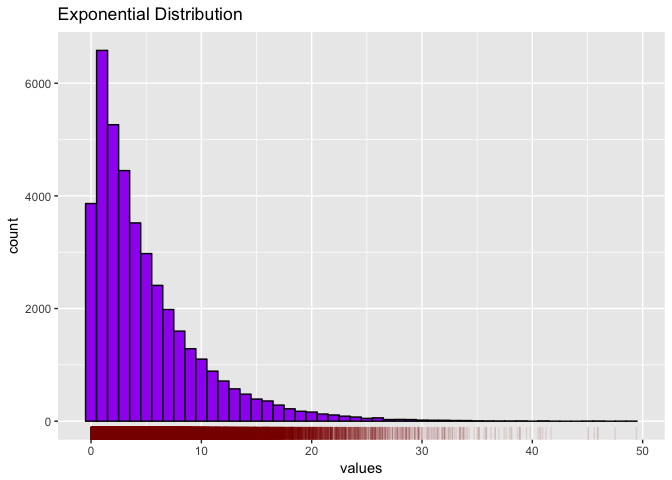
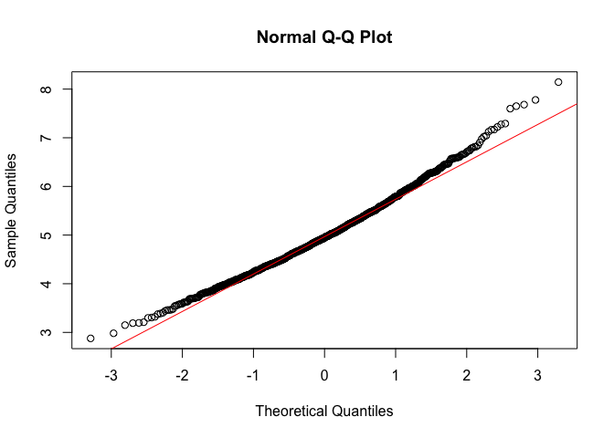

## Overview: 
In this project I will investigate the exponential distribution in R and compare it with the Central Limit Theorem. The exponential distribution will be simulated in R with rexp(n, lambda) where lambda is the rate parameter. The mean of exponential distribution is 1/lambda and the standard deviation is also 1/lambda. Set lambda = 0.2 for all of the simulations. I will investigate the distribution of averages of 40 exponentials. A thousand simulations will be presented in this report. The following are the details about how Iillustrate via simulation and associated explanatory text the properties of the distribution of the mean of 40 exponentials. 

1. Show the sample mean and compare it to the theoretical mean of the distribution.
2. Show how variable the sample is (via variance) and compare it to the theoretical variance of the distribution.
3. Show that the distribution is approximately normal and focus on the difference between the distribution of a large collection of random exponentials and the distribution of a large collection of averages of 40 exponentials.

### 0. Simulation


```r
require(ggplot2)   ## load library
```

```
## Loading required package: ggplot2
```

```r
set.seed(123456789)  ## set seed for consistent simulations

lambda <- 0.2      ## lambda
n      <- 40       ## 40 exponentials
nosim <- 1000      ## repeat 1000 simulations


## Create a exponentials data frame 1000 X 40 from rexp(x, lambda) 
simulation  <- matrix(rexp(n*nosim, lambda), nrow=nosim, ncol=n); dim(simulation)
```

```
## [1] 1000   40
```

### 1. Compare average sample mean to the theoretical mean of the distribution.

```r
## Calculate sample mean (40 exponentials)
samMean <- rowMeans(simulation)

## Calculate the mean and SD of sample means
mean.samMean <- mean(samMean)
med.samMean  <- median(samMean)

## Calculate theoretical mean
theoryMean <- 1/lambda

## Plot mean of each row
hist(samMean, main="Histogram of 1000 means of 40 sample exponentials (lambda 0.2)", xlab="Sample Means", col = "green", breaks=20)

## highlight the mean of sample means and theoretical mean for comparison
abline(v=mean.samMean, col="blue", lwd=6, lty=2)  # mean of sample mean
abline(v=theoryMean, col="red", lwd=3)            # theoretical mean line
```

<!-- -->


```
## [1] "Average of sample means: 5.005 ; Median of sample means: 4.946 Theoretical mean: 5"
```

#### Report 1: 
* The average sample mean is 5.005 and the theoretical mean is 5. The difference between the two means is equal to 0.005". The actual center of the distribution of the average of 40 exponetials (blue dotted line) is very close to its theoretical center of the distribution (red solid line).


### 2. Compare sample variance to theoretical variance of the distribution.


```r
## Calculate SD and variance of sample means
sd.samMean  <- sd(samMean)
var.samMean <- var(samMean)  

## Calculate SD and theoretical variance
sd.theory  <- (1/lambda)/sqrt(n)
var.theory  <- (1/lambda)^2/n

DF <- data.frame(Title=c("Sample SD", "Theoretical SD", "Sample Variance", "Theoretical Variance"), Values=c(round(sd.samMean,3), round(sd.theory,3), round(var.samMean,3), round(var.theory,3))); DF
```

```
##                  Title Values
## 1            Sample SD  0.788
## 2       Theoretical SD  0.791
## 3      Sample Variance  0.620
## 4 Theoretical Variance  0.625
```

#### Report 2: 
* The sample variance is 0.620 and the theoretical variance is 0.625. Both of variances are very close to each other. The actual standard deviation of the sample distribution is 0.788. The theoretical standard deviation is 0.791. The difference of two standard deviations is very small.


### 3. Show the distribution is approximately normal

#### 3a. The distribution of a 1000 means simulated from the exponential distribution  
To show the distribution is normal, we plot the distribution of simulated sample data and overlay the normal distribution with lambda=0.2 to see if the 2 distributions are aligned.

```r
ggplot(NULL, aes(x=samMean))+
      geom_histogram(aes(y = ..density..), color="black", fill='green', binwidth=.25) +
      geom_density(color='blue',lwd=1.2) +
      stat_function(fun = dnorm, args =list(mean=theoryMean, sd=sd.theory), color="red", size=1) +
      geom_vline(xintercept=mean.samMean, colour="blue",linetype= "solid", lwd=0.8,show.legend=T)+ 
      geom_vline(xintercept=theoryMean, colour="red",linetype= "dotted", lwd=1.5 ,show.legend=T)+
      labs(title= 'Sample Means Distribution', x='Sample Means')+
      geom_rug(col = "darkred", alpha = 0.1) +
      scale_x_continuous(breaks=1:20)
```

<!-- -->

#### The distribution of the exponential distribution simulated a 1000 times 

```r
simExpDist <- replicate(n = nosim, expr = rexp(n, lambda))

ggplot(NULL, aes(x=as.vector(simExpDist)))+
      geom_histogram(color="black", fill='purple', binwidth=1)+
      labs(title = "Exponential Distribution", x = "values", y = "count")+
      geom_rug(col = "darkred", alpha = 0.1)
```

<!-- -->


#### Report 3a: 
* The curve blue line is the distribution of averages of a 1000 means simulated from the exponential distribution (each one with 40 observations). The curve red line is the normal distribution, N ~ ( mu = 1/lambda, SD = (1/lambda)/sqrt(n) ), with lambda = 0.2 and n = 40. The figure shows that the 2 distribution lines, blue and red, are well aligned. This indicates the distribution of simulated data is approximately normal. 

#### 3b. Compare the confidence intervals

```r
sampleCI <- mean.samMean + c(-1,1)*1.96*sd.samMean/sqrt(n)
theoryCI <- theoryMean + c(-1,1)*1.96*sd.theory/sqrt(n)
```


```
## [1] "The actual 95% confidence interval:[ 4.761 , 5.25 ]"
```

```
## [1] "The theoretical 95% confidence interval:[ 4.755 , 5.245 ]"
```

#### Report 3b: 
* The range of the actual 95% confidence interval and the range of the theoretical 95% confidence interval are almost overlap. This indicates the distribution of simulated data is approximately normal. 

#### 3c. quantile-quantile plot (Q-Q plot) for quantiles
QQ plot is a good a graphical method for comparing two probability distributions by plotting their quantiles against each other. Qqnorm is a generic function the default method of which produces a normal QQ plot of the values in y, and qqline adds a line to a “theoretical”, by default normal. 


```r
qqnorm(samMean)
qqline(samMean, col = 2)
```

<!-- -->

#### Report 3c: 
* The deviations from the straight line are minimal. The distribution of averages of the simulated samples is approximately normal as the actual quantiles match closely with the theoretical quantiles. 


### Summary
In probability theory, the **central limit theorem** (CLT) states that, given certain conditions, the arithmetic mean of a sufficiently large number of iterates of independent random variables, each with a well-defined expected value and well-defined variance, will be approximately normally distributed, regardless of the underlying distribution. 

This simulation is performed with a relatively large population of 40,000 samples (1000 simulations x 40 samples). The above observations show that, given this sufficiently large sample size from a population with a finite level of variance, the mean of all samples from the population is approximately equal to the mean of the population. In conclusion, the normal distribution of the mean of 40 random exponentials is consistent with the characteristic of the Central Limit Theorem. 
