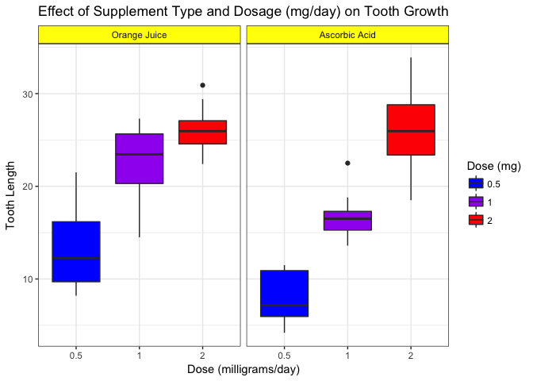
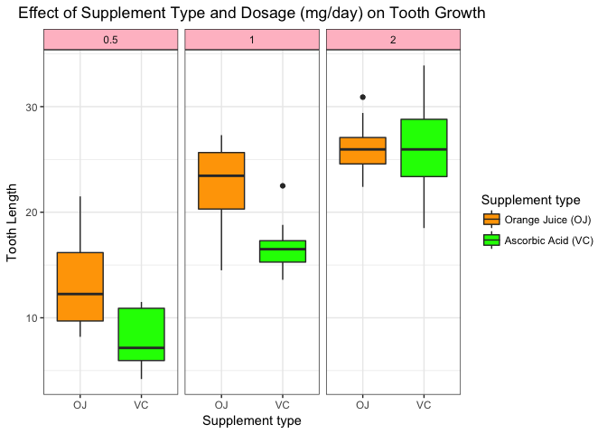

### Basic Inferential Data Analysis Instructions: 
I am going to analyze the ToothGrowth data in the R datasets package.

1. Load the ToothGrowth data and perform some basic exploratory data analyses
2. Provide a basic summary of the data.
3. Use confidence intervals and/or hypothesis tests to compare tooth growth by supp and dose. (Only use the techniques from class, even if there's other approaches worth considering)
4. State your conclusions and the assumptions needed for your conclusions.

### Review criteria
* Did you perform an exploratory data analysis of at least a single plot or table highlighting basic features of the data?
* Did the student perform some relevant confidence intervals and/or tests?
* Were the results of the tests and/or intervals interpreted in the context of the problem correctly?
* Did the student describe the assumptions needed for their conclusions?

### 1. Load the ToothGrowth data and perform some basic exploratory data analyses 
##### Overview: 
* ToothGrowth {datasets}	R Documentation
* The Effect of Vitamin C on Tooth Growth in Guinea Pigs

##### Description
* The response is the length of odontoblasts (cells responsible for tooth growth) in 60 guinea pigs. Each animal received one of three dose levels of vitamin C (0.5, 1, and 2 mg/day) by one of two delivery methods, orange juice or ascorbic acid (a form of vitamin C and coded as VC).

##### Usage
* ToothGrowth

##### Format
* A data frame with 60 observations on 3 variables.

* [,1]	len	numeric	Tooth length
* [,2]	supp	factor	Supplement type (VC or OJ).
* [,3]	dose	numeric	Dose in milligrams/day

##### Source
* C. I. Bliss (1952). The Statistics of Bioassay. Academic Press.

##### References
* McNeil, D. R. (1977). Interactive Data Analysis. New York: Wiley.

* Crampton, E. W. (1947). The growth of the odontoblast of the incisor teeth as a criterion of vitamin C intake of the guinea pig. The Journal of Nutrition, 33(5), 491–504. [doi: 10.1093/jn/33.5.491](https://doi.org/10.1093/jn/33.5.491)

### Load the ToothGrowth data

```r
# load required packages
library(ggplot2)
library(datasets)

# Load the data
data(ToothGrowth); dim(ToothGrowth)
```

```
## [1] 60  3
```

### Data exploration


```r
# Look at the first 6 rows of the data
head(ToothGrowth)
```

```
##    len supp dose
## 1  4.2   VC  0.5
## 2 11.5   VC  0.5
## 3  7.3   VC  0.5
## 4  5.8   VC  0.5
## 5  6.4   VC  0.5
## 6 10.0   VC  0.5
```


```r
# Look at the structure of the data
str(ToothGrowth)
```

```
## 'data.frame':	60 obs. of  3 variables:
##  $ len : num  4.2 11.5 7.3 5.8 6.4 10 11.2 11.2 5.2 7 ...
##  $ supp: Factor w/ 2 levels "OJ","VC": 2 2 2 2 2 2 2 2 2 2 ...
##  $ dose: num  0.5 0.5 0.5 0.5 0.5 0.5 0.5 0.5 0.5 0.5 ...
```

* The data includes 60 observations and 3 variables: 1. len (numeric) - Tooth length, 2. supp (factor) - Supplement type (OJ or VC), 3. dose (numeric) - Dose in milligrams/day

### 2. Provide a basic summary of the data.
#### Look at the summary of the data

```r
# convert does to factor
ToothGrowth$dose <- as.factor(ToothGrowth$dose)

summary(ToothGrowth)
```

```
##       len        supp     dose   
##  Min.   : 4.20   OJ:30   0.5:20  
##  1st Qu.:13.07   VC:30   1  :20  
##  Median :19.25           2  :20  
##  Mean   :18.81                   
##  3rd Qu.:25.27                   
##  Max.   :33.90
```

```r
table(ToothGrowth$supp, ToothGrowth$dose)
```

```
##     
##      0.5  1  2
##   OJ  10 10 10
##   VC  10 10 10
```

#### Make a plot to look at data graphically 

```r
ggplot(ToothGrowth, aes(x=dose, y=len, fill=dose)) + 
      geom_boxplot() +
      scale_fill_manual(breaks = c("0.5", "1", "2"), values = c("blue", "purple", "red")) +
      facet_grid(.~supp, labeller = as_labeller(c("OJ" = "Orange Juice", "VC" = "Ascorbic Acid"))) +
      theme_bw()+
      theme(plot.title = element_text(hjust = 0.5)) +
      theme(strip.background =element_rect(fill="yellow")) +
      labs(title = "Effect of Supplement Type and Dosage (mg/day) on Tooth Growth", 
               x = "Dose (milligrams/day)", 
               y = "Tooth Length",
            fill = "Dose (mg)") 
```

<!-- -->


```r
ggplot(ToothGrowth, aes(x=supp, y=len, fill=supp)) + 
      geom_boxplot() +
      scale_fill_manual(breaks = c("OJ", "VC"), values = c("orange", "green"), labels=c("Orange Juice (OJ)", "Ascorbic Acid (VC)")) +
      facet_grid(.~dose) +
      theme_bw()+
      theme(plot.title = element_text(hjust = 0.5)) +
      theme(strip.background =element_rect(fill="pink")) +
      labs(title = "Effect of Supplement Type and Dosage (mg/day) on Tooth Growth", 
               x = "Supplement type", 
               y = "Tooth Length",
            fill = "Supplement type") 
```

<!-- -->

* There is a positive effect of the dosage, as the dosage increases the tooth growth increases in both supplements. Especially, the tooth growth seems have a linear relationship with dosage by the ascorbic acid (VC) supplement. However, the tooth growth with the orange juice (OJ) supplement at dossage 2.0 mg/day seems have less improvement. At dossage 2.0 mg/day, the mean of tooth growth with orange juice supplement seems similar to that with ascorbic acid supplement.

### 3. Use confidence intervals and/or hypothesis tests to compare tooth growth by supp and dose.
Assumptions: there is no difference in the tooth growth by dosage amount and delivery method


#### Dose: 0.5 vs 1 ( Ho: 0.5 = 1 )


```r
t.test(ToothGrowth$len[ToothGrowth$dose == 0.5], ToothGrowth$len[ToothGrowth$dose == 1])
```

```
## 
## 	Welch Two Sample t-test
## 
## data:  ToothGrowth$len[ToothGrowth$dose == 0.5] and ToothGrowth$len[ToothGrowth$dose == 1]
## t = -6.4766, df = 37.986, p-value = 1.268e-07
## alternative hypothesis: true difference in means is not equal to 0
## 95 percent confidence interval:
##  -11.983781  -6.276219
## sample estimates:
## mean of x mean of y 
##    10.605    19.735
```


#### Dose: 0.5 vs 2 ( Ho: 0.5 = 2 )


```r
t.test(ToothGrowth$len[ToothGrowth$dose == 0.5], ToothGrowth$len[ToothGrowth$dose == 2])
```

```
## 
## 	Welch Two Sample t-test
## 
## data:  ToothGrowth$len[ToothGrowth$dose == 0.5] and ToothGrowth$len[ToothGrowth$dose == 2]
## t = -11.799, df = 36.883, p-value = 4.398e-14
## alternative hypothesis: true difference in means is not equal to 0
## 95 percent confidence interval:
##  -18.15617 -12.83383
## sample estimates:
## mean of x mean of y 
##    10.605    26.100
```

#### Dose: 1 vs 2 ( Ho: 1 = 2 )


```r
t.test(ToothGrowth$len[ToothGrowth$dose == 1], ToothGrowth$len[ToothGrowth$dose == 2])
```

```
## 
## 	Welch Two Sample t-test
## 
## data:  ToothGrowth$len[ToothGrowth$dose == 1] and ToothGrowth$len[ToothGrowth$dose == 2]
## t = -4.9005, df = 37.101, p-value = 1.906e-05
## alternative hypothesis: true difference in means is not equal to 0
## 95 percent confidence interval:
##  -8.996481 -3.733519
## sample estimates:
## mean of x mean of y 
##    19.735    26.100
```


#### Orange juice vs Ascorbic acid at dose 0.5 mg/day ( Ho: OJ:0.5 = VC:0.5 )


```r
x <- ToothGrowth$len[ToothGrowth$supp=="OJ" & ToothGrowth$dose == 0.5]
y <- ToothGrowth$len[ToothGrowth$supp=="VC" & ToothGrowth$dose == 0.5]
t.test(x, y, paired = FALSE, var.equal = FALSE, conf.level = 0.95)
```

```
## 
## 	Welch Two Sample t-test
## 
## data:  x and y
## t = 3.1697, df = 14.969, p-value = 0.006359
## alternative hypothesis: true difference in means is not equal to 0
## 95 percent confidence interval:
##  1.719057 8.780943
## sample estimates:
## mean of x mean of y 
##     13.23      7.98
```

#### Orange juice at dose 0.5 mg/day vs Ascorbic acid at dose 1 mg/day ( Ho: OJ:0.5 = VC:1 )


```r
x <- ToothGrowth$len[ToothGrowth$supp=="OJ" & ToothGrowth$dose == 0.5]
y <- ToothGrowth$len[ToothGrowth$supp=="VC" & ToothGrowth$dose == 1]
t.test(x, y, paired = FALSE, var.equal = FALSE, conf.level = 0.95)
```

```
## 
## 	Welch Two Sample t-test
## 
## data:  x and y
## t = -2.1864, df = 14.2, p-value = 0.04601
## alternative hypothesis: true difference in means is not equal to 0
## 95 percent confidence interval:
##  -7.00810903 -0.07189097
## sample estimates:
## mean of x mean of y 
##     13.23     16.77
```


#### Orange juice at dose 0.5 mg/day vs Ascorbic acid at dose 2 mg/day ( Ho: OJ:0.5 = VC:2 ) 


```r
x <- ToothGrowth$len[ToothGrowth$supp=="OJ" & ToothGrowth$dose == 0.5]
y <- ToothGrowth$len[ToothGrowth$supp=="VC" & ToothGrowth$dose == 2]
t.test(x, y, paired = FALSE, var.equal = FALSE, conf.level = 0.95)
```

```
## 
## 	Welch Two Sample t-test
## 
## data:  x and y
## t = -6.2325, df = 17.905, p-value = 7.196e-06
## alternative hypothesis: true difference in means is not equal to 0
## 95 percent confidence interval:
##  -17.263522  -8.556478
## sample estimates:
## mean of x mean of y 
##     13.23     26.14
```


#### Orange juice at dose 1 mg/day vs Ascorbic acid at dose 0.5 mg/day ( Ho: OJ:1 = VC:0.5 )


```r
x <- ToothGrowth$len[ToothGrowth$supp=="OJ" & ToothGrowth$dose == 1]
y <- ToothGrowth$len[ToothGrowth$supp=="VC" & ToothGrowth$dose == 0.5]
t.test(x, y, paired = FALSE, var.equal = FALSE, conf.level = 0.95)
```

```
## 
## 	Welch Two Sample t-test
## 
## data:  x and y
## t = 9.7401, df = 16.141, p-value = 3.655e-08
## alternative hypothesis: true difference in means is not equal to 0
## 95 percent confidence interval:
##  11.51851 17.92149
## sample estimates:
## mean of x mean of y 
##     22.70      7.98
```


#### Orange juice vs Ascorbic acid at dose 1 mg/day ( Ho: OJ:1 = VC:1 )


```r
x <- ToothGrowth$len[ToothGrowth$supp=="OJ" & ToothGrowth$dose == 1]
y <- ToothGrowth$len[ToothGrowth$supp=="VC" & ToothGrowth$dose == 1]
t.test(x, y, paired = FALSE, var.equal = FALSE, conf.level = 0.95)
```

```
## 
## 	Welch Two Sample t-test
## 
## data:  x and y
## t = 4.0328, df = 15.358, p-value = 0.001038
## alternative hypothesis: true difference in means is not equal to 0
## 95 percent confidence interval:
##  2.802148 9.057852
## sample estimates:
## mean of x mean of y 
##     22.70     16.77
```


#### Orange juice at dose 1 mg/day vs Ascorbic acid at dose 2 mg/day ( Ho: OJ:1 = VC:2 )


```r
x <- ToothGrowth$len[ToothGrowth$supp=="OJ" & ToothGrowth$dose == 1]
y <- ToothGrowth$len[ToothGrowth$supp=="VC" & ToothGrowth$dose == 2]
t.test(x, y, paired = FALSE, var.equal = FALSE, conf.level = 0.95)
```

```
## 
## 	Welch Two Sample t-test
## 
## data:  x and y
## t = -1.7574, df = 17.297, p-value = 0.09653
## alternative hypothesis: true difference in means is not equal to 0
## 95 percent confidence interval:
##  -7.5643336  0.6843336
## sample estimates:
## mean of x mean of y 
##     22.70     26.14
```


#### Orange juice at dose 2 mg/day vs Ascorbic acid at dose 0.5 mg/day ( Ho: OJ:2 = VC:0.5 )


```r
x <- ToothGrowth$len[ToothGrowth$supp=="OJ" & ToothGrowth$dose == 2]
y <- ToothGrowth$len[ToothGrowth$supp=="VC" & ToothGrowth$dose == 0.5]
t.test(x, y, paired = FALSE, var.equal = FALSE, conf.level = 0.95)
```

```
## 
## 	Welch Two Sample t-test
## 
## data:  x and y
## t = 14.967, df = 17.979, p-value = 1.362e-11
## alternative hypothesis: true difference in means is not equal to 0
## 95 percent confidence interval:
##  15.54182 20.61818
## sample estimates:
## mean of x mean of y 
##     26.06      7.98
```


#### Orange juice at dose 2 mg/day vs Ascorbic acid at dose 1 mg/day ( Ho: OJ:2 = VC:1 )


```r
x <- ToothGrowth$len[ToothGrowth$supp=="OJ" & ToothGrowth$dose == 2]
y <- ToothGrowth$len[ToothGrowth$supp=="VC" & ToothGrowth$dose == 1]
t.test(x, y, paired = FALSE, var.equal = FALSE, conf.level = 0.95)
```

```
## 
## 	Welch Two Sample t-test
## 
## data:  x and y
## t = 8.0325, df = 17.948, p-value = 2.361e-07
## alternative hypothesis: true difference in means is not equal to 0
## 95 percent confidence interval:
##   6.859667 11.720333
## sample estimates:
## mean of x mean of y 
##     26.06     16.77
```


#### Orange juice vs Ascorbic acid at dose 2 mg/day ( Ho: OJ:2 = VC:2 )

```r
x <- ToothGrowth$len[ToothGrowth$supp=="OJ" & ToothGrowth$dose == 2]
y <- ToothGrowth$len[ToothGrowth$supp=="VC" & ToothGrowth$dose == 2]
t.test(x, y, paired = FALSE, var.equal = FALSE, conf.level = 0.95)
```

```
## 
## 	Welch Two Sample t-test
## 
## data:  x and y
## t = -0.046136, df = 14.04, p-value = 0.9639
## alternative hypothesis: true difference in means is not equal to 0
## 95 percent confidence interval:
##  -3.79807  3.63807
## sample estimates:
## mean of x mean of y 
##     26.06     26.14
```


#### Report 
The analysis shows that there are significant differences between each of the scenarios in supp and dose, except for the following scenarios:

* Orange juice at dose 1 mg/day vs Ascorbic acid at dose 2 mg/day (Ho: OJ:1 = VC:2 )
* Orange juice vs Ascorbic acid at dose 2 mg/day (Ho: OJ:2 = VC:2 )

Because their p-values are greater than 0.05, this indicates that there are no statistical significant different between their means. Thus, with 95% confidence interval, the null hypothesis was accepted. 

### 4. Conclusions
Overall, both the supplement and the dosage have positive effects on the tooth length of guinea pigs. When the dosage increases the tooth growth increases in both supplements. With 95% confidence interval, orange juice (OJ) supplement has a greater avarage teethgrowth in combination with dosages 0.5 and 1 than the ascorbic acid (VC) supplement, but there is no significant mean different between two supplements at dosage 2 mg/day. Moreover, guinea pigs receive orange juice at dosage 1 mg/day may have similar tooth length when they receive ascorbic acid at dosage 2 mg/day.

