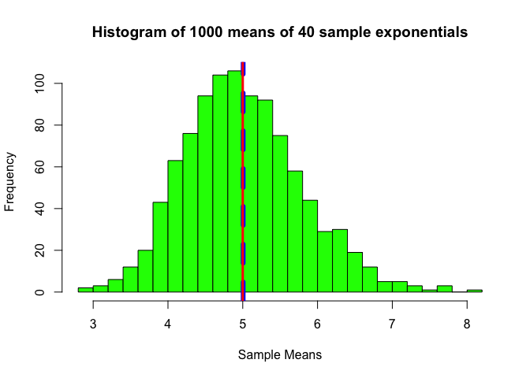
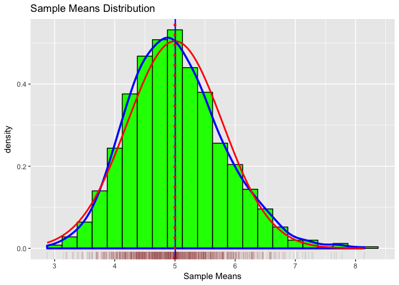

#### Overview: 
In this project I will investigate the exponential distribution in R and compare it with the Central Limit Theorem. The exponential distribution will be simulated in R with rexp(n, lambda). The mean of exponential distribution is 1/lambda and the standard deviation is also 1/lambda. Set lambda = 0.2 for all of the simulations. The distribution of averages of 40 exponentials and 1000 simulations will be presented in this report.

#### 1. Compare average sample mean to the theoretical mean of the distribution.

```r
require(ggplot2)   
```

```
## Loading required package: ggplot2
```

```r
set.seed(123456789)  ## set seed for consistent simulations
lambda <- 0.2 ; n      <- 40       ; nosim <- 1000      
simulation  <- matrix(rexp(n*nosim, lambda), nrow=nosim, ncol=n)
samMean <- rowMeans(simulation) #Calculate sample mean (40 exponentials)
mean.samMean <- mean(samMean); theoryMean <- 1/lambda 
hist(samMean, main="Histogram of 1000 means of 40 sample exponentials", xlab="Sample Means", col = "green", breaks=20)
abline(v=mean.samMean, col="blue", lwd=6, lty=2)  # mean of sample mean
abline(v=theoryMean, col="red", lwd=3)            # theoretical mean line
```

<!-- -->


```
## [1] "Average of sample means: 5.005 Theoretical mean: 5"
```

* The average sample mean is 5.005 and the theoretical mean is 5. The difference between the two means is equal to 0.005".

#### 2. Compare sample variance to theoretical variance of the distribution.

```r
## Calculate SD and variance of sample means and theoretical variance
sd.samMean  <- sd(samMean); var.samMean <- var(samMean);   var.samMean
```

```
## [1] 0.6203113
```

```r
sd.theory  <- (1/lambda)/sqrt(n); var.theory  <- (1/lambda)^2/n; var.theory
```

```
## [1] 0.625
```
* The sample variance is 0.620 and the theoretical variance is 0.625. Both of variances are very close to each other. 

#### 3. Show the distribution is approximately normal
##### 3a. The distribution of a 1000 means simulated from the exponential distribution  

```r
ggplot(NULL, aes(x=samMean))+
      geom_histogram(aes(y = ..density..), color="black", fill='green', binwidth=.25) +
      geom_density(color='blue',lwd=1.2) +
      stat_function(fun = dnorm, args =list(mean=theoryMean, sd=sd.theory), color="red", size=1) +
      geom_vline(xintercept=mean.samMean, colour="blue",linetype= "solid", lwd=0.8,show.legend=T)+ 
      geom_vline(xintercept=theoryMean, colour="red",linetype= "dotted", lwd=1.5 ,show.legend=T)+
      labs(title= 'Sample Means Distribution', x='Sample Means')+
      geom_rug(col = "darkred", alpha = 0.1) +
      scale_x_continuous(breaks=1:20)
```

<!-- -->
* The curve blue line is the distribution of averages of a 1000 means simulated from the exponential distribution. The curve red line is the normal distribution, N ~ (1/lambda, (1/lambda)/sqrt(n)). The figure shows that the 2 distribution lines, blue and red, are well aligned. This indicates the distribution of simulated data is approximately normal. 

##### 3b. Compare the confidence intervals

```r
sampleCI <- mean.samMean + c(-1,1)*1.96*sd.samMean/sqrt(n); sampleCI
```

```
## [1] 4.761360 5.249519
```

```r
theoryCI <- theoryMean + c(-1,1)*1.96*sd.theory/sqrt(n); theoryCI
```

```
## [1] 4.755 5.245
```
* The range of the actual 95% confidence interval and the range of the theoretical 95% confidence interval are almost overlap. This indicates the distribution of simulated data is approximately normal. 


#### 4. Summary
In probability theory, the **central limit theorem** (CLT) states that, given certain conditions, the arithmetic mean of a sufficiently large number of iterates of independent random variables, each with a well-defined expected value and well-defined variance, will be approximately normally distributed, regardless of the underlying distribution. This simulation is performed with a relatively large population of 40,000 samples. The above observations show that, given this sufficiently large sample size from a population with a finite level of variance, the mean of all samples from the population is approximately equal to the mean of the population. In conclusion, the normal distribution of the mean of 40 random exponentials is consistent with the characteristic of the Central Limit Theorem. 
