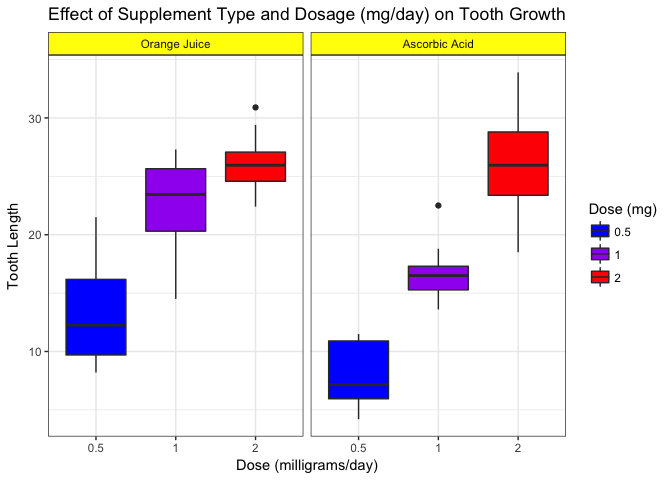

#### Basic Inferential Data Analysis Instructions: 
I am going to analyze the ToothGrowth data in the R datasets package. The following are the details:

#### 1. Load the ToothGrowth data and perform some basic exploratory data analyses 

```r
library(ggplot2)  # load required packages
data(ToothGrowth) # Load the data
str(ToothGrowth)  # Look at the structure of the data
```

```
## 'data.frame':	60 obs. of  3 variables:
##  $ len : num  4.2 11.5 7.3 5.8 6.4 10 11.2 11.2 5.2 7 ...
##  $ supp: Factor w/ 2 levels "OJ","VC": 2 2 2 2 2 2 2 2 2 2 ...
##  $ dose: num  0.5 0.5 0.5 0.5 0.5 0.5 0.5 0.5 0.5 0.5 ...
```

* The data includes 60 observations and 3 variables: 1. len - Tooth length, 2. supp - Supplement type, 3. dose - Dose in milligrams/day

#### 2. Provide a basic summary of the data.

```r
# convert does to factor
ToothGrowth$dose <- as.factor(ToothGrowth$dose); summary(ToothGrowth)
```

```
##       len        supp     dose   
##  Min.   : 4.20   OJ:30   0.5:20  
##  1st Qu.:13.07   VC:30   1  :20  
##  Median :19.25           2  :20  
##  Mean   :18.81                   
##  3rd Qu.:25.27                   
##  Max.   :33.90
```

#### 3. Confidence intervals and hypothesis tests to compare tooth growth
Assumptions: there is no difference in the tooth growth by dosage amount and delivery method


```r
##### Dose: 0.5 vs 1 ( Ho: 0.5 = 1 )
t.test(ToothGrowth$len[ToothGrowth$dose == 0.5], ToothGrowth$len[ToothGrowth$dose == 1])$p.value
```

```
## [1] 1.268301e-07
```


```r
##### Dose: 0.5 vs 2 ( Ho: 0.5 = 2 )
t.test(ToothGrowth$len[ToothGrowth$dose == 0.5], ToothGrowth$len[ToothGrowth$dose == 2])$p.value
```

```
## [1] 4.397525e-14
```


```r
##### Dose: 1 vs 2 ( Ho: 1 = 2 )
t.test(ToothGrowth$len[ToothGrowth$dose == 1], ToothGrowth$len[ToothGrowth$dose == 2])$p.value
```

```
## [1] 1.90643e-05
```


```r
##### Orange juice vs Ascorbic acid at dose 0.5 mg/day ( Ho: OJ:0.5 = VC:0.5 )
x <- ToothGrowth$len[ToothGrowth$supp=="OJ" & ToothGrowth$dose == 0.5]
y <- ToothGrowth$len[ToothGrowth$supp=="VC" & ToothGrowth$dose == 0.5]
t.test(x, y, paired = FALSE, var.equal = FALSE, conf.level = 0.95)
```

```
## 
## 	Welch Two Sample t-test
## 
## data:  x and y
## t = 3.1697, df = 14.969, p-value = 0.006359
## alternative hypothesis: true difference in means is not equal to 0
## 95 percent confidence interval:
##  1.719057 8.780943
## sample estimates:
## mean of x mean of y 
##     13.23      7.98
```


```r
##### Orange juice vs Ascorbic acid at dose 1 mg/day ( Ho: OJ:1 = VC:1 )
x <- ToothGrowth$len[ToothGrowth$supp=="OJ" & ToothGrowth$dose == 1]
y <- ToothGrowth$len[ToothGrowth$supp=="VC" & ToothGrowth$dose == 1]
t.test(x, y, paired = FALSE, var.equal = FALSE, conf.level = 0.95)
```

```
## 
## 	Welch Two Sample t-test
## 
## data:  x and y
## t = 4.0328, df = 15.358, p-value = 0.001038
## alternative hypothesis: true difference in means is not equal to 0
## 95 percent confidence interval:
##  2.802148 9.057852
## sample estimates:
## mean of x mean of y 
##     22.70     16.77
```


```r
##### Orange juice vs Ascorbic acid at dose 2 mg/day ( Ho: OJ:2 = VC:2 )
x <- ToothGrowth$len[ToothGrowth$supp=="OJ" & ToothGrowth$dose == 2]
y <- ToothGrowth$len[ToothGrowth$supp=="VC" & ToothGrowth$dose == 2]
t.test(x, y, paired = FALSE, var.equal = FALSE, conf.level = 0.95)
```

```
## 
## 	Welch Two Sample t-test
## 
## data:  x and y
## t = -0.046136, df = 14.04, p-value = 0.9639
## alternative hypothesis: true difference in means is not equal to 0
## 95 percent confidence interval:
##  -3.79807  3.63807
## sample estimates:
## mean of x mean of y 
##     26.06     26.14
```

* The analysis shows that there are significant differences between each of the scenarios in supp and dose, except for the scenario: OJ vs VC at dose 2 mg/day. Because the p-values is greater than 0.05, this indicates that there is no statistical significant different between their means. Thus, the null hypothesis was accepted. 


```r
ggplot(ToothGrowth, aes(x=dose, y=len, fill=dose)) + geom_boxplot() +
      scale_fill_manual(breaks = c("0.5", "1", "2"), values = c("blue", "purple", "red")) +
      facet_grid(.~supp, labeller = as_labeller(c("OJ" = "Orange Juice", "VC" = "Ascorbic Acid"))) +
      theme_bw()+ theme(plot.title = element_text(hjust = 0.5)) +
      theme(strip.background =element_rect(fill="yellow")) +
      labs(title = "Effect of Supplement Type and Dosage (mg/day) on Tooth Growth", 
               x = "Dose (milligrams/day)", y = "Tooth Length", fill = "Dose (mg)") 
```

<!-- -->

* There is a positive effect of the dosage, as the dosage increases the tooth growth increases in both supplements. However, At dossage 2.0 mg/day, the mean of tooth growth with OJ supplement are similar to that with VC supplement.


#### 4. Conclusions
Overall, both the supplement and the dosage have positive effects on the tooth length of guinea pigs. When the dosage increases the tooth growth increases in both supplements. With 95% confidence interval, orange juice (OJ) supplement has a greater avarage teethgrowth in combination with dosages 0.5 and 1 than the ascorbic acid (VC) supplement, but there is no significant mean different between two supplements at dosage 2 mg/day. 

